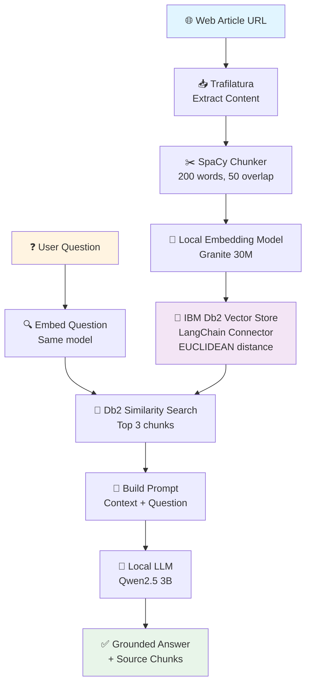

# RAG with IBM Db2 & Local LLMs

A Retrieval-Augmented Generation (RAG) pipeline that answers questions by grounding responses in web content stored in **IBM Db2's vector database**. This project leverages **Db2's native vector search capabilities** and the **official LangChain-Db2 connector** for seamless integration with local LLM models.

---

## Overview

**The Problem:** Large Language Models can hallucinate or provide outdated information.

**The Solution:** RAG grounds LLM responses in specific, retrieved documents.

### Why IBM Db2?

- **Native Vector Support** — Db2's built-in vector data type and similarity search
- **Db2 LangChain Connector** — Seamless integration via `langchain-db2` package
- **Enterprise-Grade** — Production-ready vector storage with ACID compliance

### Key Benefits

- Factual answers backed by source documents
- Runs entirely on CPU (no GPU required)
- Works offline with local models (no API costs)
- Full control over embedding and generation models

### Pipeline Architecture



---

## Pipeline Components

| Step | Component | Configuration |
|------|-----------|---------------|
| 1. Web Scraping | `trafilatura` | Fetches article from URL |
| 2. Text Chunking | `spaCy` + custom chunker | 200 words/chunk, 50-word overlap |
| 3. Embeddings | `LlamaCppEmbeddings` | Granite 30M, 16 threads |
| 4. Vector Store | `DB2VS` | EUCLIDEAN distance strategy |
| 5. Retrieval | `as_retriever()` | Top-3 similarity search |
| 6. LLM | `LlamaCpp` | Qwen2.5-3B, 30 threads, CPU-only |
| 7. RAG Chain | `RetrievalQA` | Combines retrieval + generation |

---

## Tech Stack

| Component | Purpose |
|-----------|---------|
| **LangChain** | RAG framework & orchestration |
| **IBM Db2** | Vector storage & similarity search |
| **llama.cpp** | Efficient local model inference |
| **spaCy** | Sentence segmentation for chunking |
| **trafilatura** | Web content extraction |
| **python-dotenv** | Environment variable management |
| **uv** | Fast Python package management |

---

## Prerequisites

- Python 3.13+
- IBM Db2 12.1.2+
- ~4GB disk space for models
- 8GB+ RAM (32+ cores recommended for best performance)
- CPU-only (no GPU required)
- `uv` package manager ([install here](https://github.com/astral-sh/uv))

---

## Project Structure

```
db2-langchain-rag-local/
├── rag-basic.ipynb          # Main notebook
├── requirements.txt         # Python dependencies (pinned versions)
├── .env                     # Configuration (DO NOT COMMIT)
├── .gitignore              # Git ignore rules
└── README.md               # This file
```

---

## Lab Environment Setup

### Environment Overview

This lab uses a single virtual machine on an IBM Cloud environment. All required components are pre-installed.

**Installed components:**

| Component | Version |
|---|---|
| Db2 AI Advanced Edition (Single Partition) | 12.1.5 |

**Pre-configured databases:** `demo_col`, `demo_row`, `REPODB` *(created on first Genius Hub login)*

**Utility scripts:**

| Script | Purpose |
|---|---|
| `ghinfo` | Display environment details |
| `start-services.sh` | Start required services |
| `ghstatus` | Check status of Db2 Genius Hub services |
| `ghstart` | Start Db2 Genius Hub services |
| `ghstop` | Stop Db2 Genius Hub services |
| `ghrestart` | Restart Db2 Genius Hub services |

### Service Endpoints

| Service | Endpoint |
|---|---|
| **Db2 Host (for Genius Hub)** | `localhost` |
| **Db2 Host (for external tools)** | `YOUR-EXTERNAL-IP` |
| **Db2 Port** | `25011` |
| **SSH Access** | `ssh -i YOUR-FILE.pem YOUR-USER@YOUR-EXTERNAL-IP -p 2223` |

> Replace `YOUR-FILE.pem`, `YOUR-USER`, and `YOUR-EXTERNAL-IP` with the values provided for your lab environment.

### Default Credentials

**Genius Hub UI:**

| Field | Value |
|---|---|
| Username | `admin` |
| Password | `Db2ghPassw0rd#1` |

**Db2 Users** (all share the same password):

| Username | Password |
|---|---|
| `db2inst1` | `Db2ghPassw0rd#1` |
| `db2demo` | `Db2ghPassw0rd#1` |

### SSH Access

Your instructor will provide your VM's public IP address and a personal PEM key file (e.g., `student_01.pem`). All students connect as the `db2demo` user.

**Step 1 — Set file permissions**

*Mac/Linux:*
```bash
cd ~/Desktop
chmod 600 student_01.pem
```

*Windows (PowerShell):*
```powershell
icacls student_01.pem /inheritance:r
icacls student_01.pem /grant:r "%USERNAME%:F"
```

*Windows (GUI):* Right-click the `.pem` file → Properties → Security → Advanced → Disable inheritance → Remove all inherited permissions → Add your Windows username with Full control.

**Step 2 — Connect**

*Mac/Linux/Windows PowerShell:*
```bash
ssh -i student_01.pem db2demo@52.118.191.168 -p 2223
```

*Windows (PuTTY):* Convert your `.pem` to `.ppk` using PuTTYgen (File → Load → Save private key), then open PuTTY with Host = your IP, Port = `2223`, and your `.ppk` under Connection → SSH → Auth.

On first connection, type `yes` when prompted about host authenticity. A successful login shows:
```
[db2demo@db2gh-demo ~]$
```

---

## Installation

### 1. Install uv

```bash
curl -LsSf https://astral.sh/uv/install.sh | sh
source ~/.bashrc  # or ~/.bash_profile
```

### 2. Start Db2

```bash
db2start
```

### 3. Download Models

Navigate to your models directory:
```bash
cd /more_storage/models
```

**Embedding Model** (30M parameters, ~32MB):
```bash
wget -O granite-embedding-30m-english-Q6_K.gguf \
  https://huggingface.co/lmstudio-community/granite-embedding-30m-english-GGUF/resolve/main/granite-embedding-30m-english-Q6_K.gguf
```

**LLM Model** (3B parameters, ~2GB):
```bash
wget -O qwen2.5-3b-instruct-q4_k_m.gguf \
  https://huggingface.co/Qwen/Qwen2.5-3B-Instruct-GGUF/resolve/main/qwen2.5-3b-instruct-q4_k_m.gguf
```

### 4. Clone Repository

```bash
git clone https://github.com/shaikhq/db2-langchain-rag-local.git
cd db2-langchain-rag-local
```

### 5. Set Up Environment & Dependencies

```bash
uv venv --python $(which python3.13)
uv pip install -r requirements.txt
uv pip install pip
uv run python -m spacy download en_core_web_sm
```

### 6. Configure Environment Variables

Create a `.env` file in the project root:
```bash
touch .env
```

Add the following (replace with your values):
```bash
# IBM Db2 Configuration
DB_NAME=your_database
DB_HOST=hostname.example.com
DB_PORT=50000
DB_PROTOCOL=TCPIP
DB_USER=your_username
DB_PASSWORD=your_password

# Model Paths (MUST be absolute paths)
LLM_PATH=/absolute/path/to/qwen2.5-3b-instruct-q4_k_m.gguf
EMBEDDING_MODEL_PATH=/absolute/path/to/granite-embedding-30m-english-Q6_K.gguf
```

---

## Usage

### Launch Jupyter

Activate your virtual environment and start the notebook:
```bash
source .venv/bin/activate  # or .venv\Scripts\activate on Windows
jupyter notebook rag-basic.ipynb
```

### Ask Questions

```python
result = rag.invoke('How to build a linear regression model in Db2?')

markdown_output = f"""
## 💡 Answer

{result['result']}

---

## 📚 Retrieved Context
"""

for i, doc in enumerate(result['source_documents'], 1):
    markdown_output += f"\n**📄 Chunk {i}**\n\n{doc.page_content}\n\n---\n"

display(Markdown(markdown_output))
```

**What happens under the hood:**
1. Question is embedded using the local embedding model
2. Db2 finds the 3 most similar chunks via vector search
3. Chunks are injected into the prompt as context
4. Local LLM generates an answer grounded in that context
5. Returns both the answer and the source documents

---

## Optional: VS Code + Jupyter Setup

1. **Select Interpreter:** `Cmd+Shift+P` (Mac) or `Ctrl+Shift+P` (Win/Linux) → **Python: Select Interpreter** → select `.venv/bin/python`
2. **Select Jupyter Kernel:** `Cmd+Shift+P` → **Jupyter: Select Interpreter to Start Jupyter Server** → choose the same `.venv` Python
3. **If kernel doesn't appear:** Run **Developer: Reload Window** or restart VS Code

---

## Contact

**Shaikh Quader** — [LinkedIn](https://www.linkedin.com/in/shaikhquader/)

## Acknowledgments

- IBM Db2 team for native vector support and the Db2 connector
- llama.cpp for efficient CPU inference
- Qwen and IBM Granite model teams
